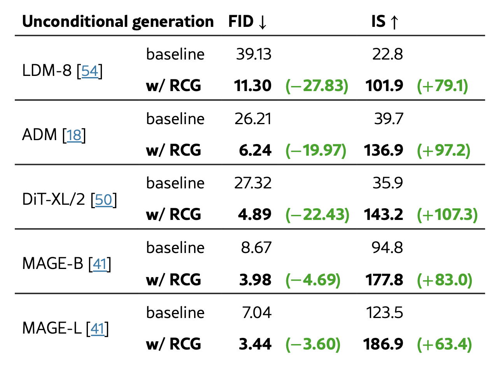
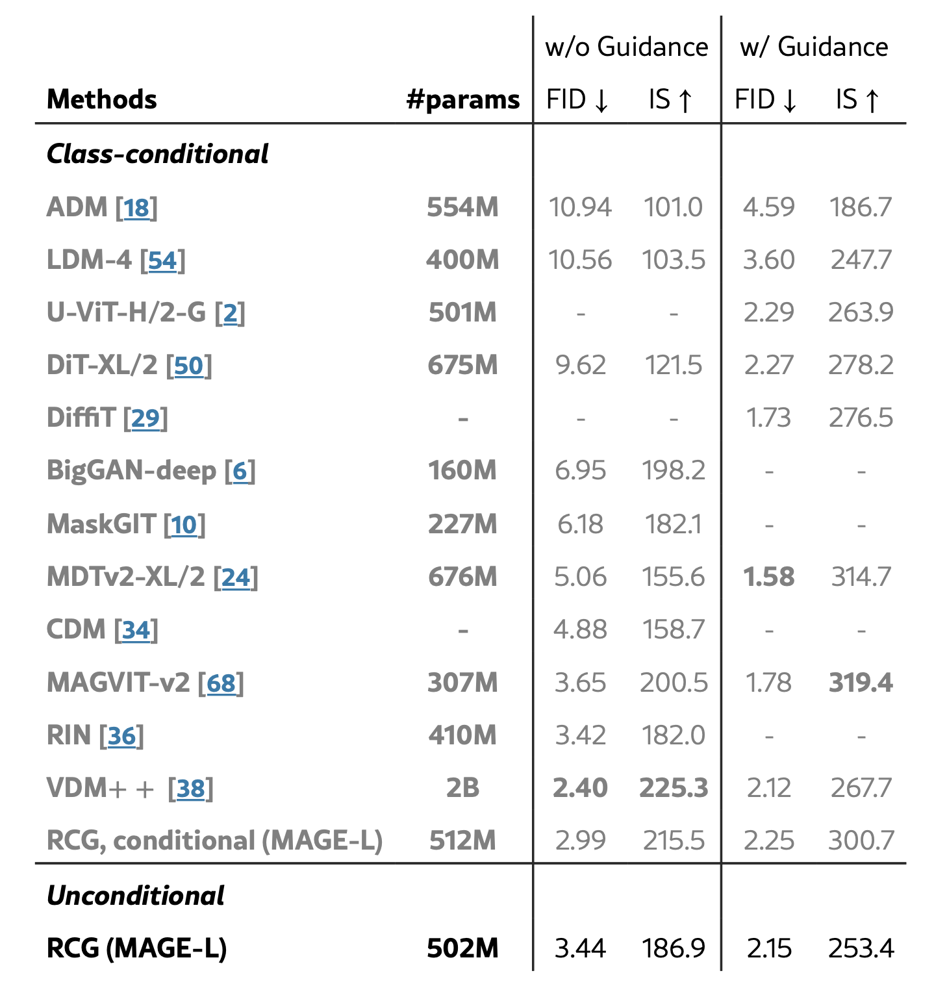

# 无条件生成的回归：一种自监督表示生成方法

## 问题
本文关注无条件生成问题，即无需依赖人工标注标签的数据分布建模问题。

## 出发点
现有文献中，无条件生成方法的生成质量远低于有条件生成方法。这一差距主要归因于缺乏标签提供的语义信息【18】。

【18】ADM 证据，Classifer Diffusion
【32】Classfier-free Diffusion

## 相关工作

【54】LDM Lantent Diffusion
【51】DiffAE，与本文高度相关，但是语义编码器的构建不够好
【41】MAGE

【46】Group Index as label
【5】Retrieval-augmented Generative Models

## 方法
本文观察到，现有的自监督编码器在没有人工标签的情况下，能够很好地捕捉大部分语义信息。这些自监督表示可以作为条件的一种形式，而不会违反无条件生成的无监督本质。

基于这一观察，本文提出了一种新的框架——表示条件生成（Representation Condition Generation, RCG），利用自监督编码器生成语义表示来条件化生成器。在不依赖标签信息的情况下，为无条件生成问题提供了一个有效的解决方案。该框架不仅限于扩散模型，适用于任意生成模型，为无条件生成问题提供了一种新的范式。

具体来说，RCG 包括三个关键组件：一个预训练的自监督图像编码器、一个表示生成器和一个图像生成器。
1. **分布映射（Distribution Mapping）**：基于现成的自监督编码器，将图像分布映射到一个低维的表示分布（如 MoCov3【】）。
2. **表示生成（Representation Generation）**：基于扩散模型，对所得到的表示分布进行学习，生成一个无条件的表示分布。
3. **图像生成（Image Generation）**：利用任意现代的条件生成模型，将所生成的表示作为条件，生成图像。

该 RCG 框架同样支持条件生成任务，具体来说，包括以下两种方法：
- **指导（Guided）**：在图像生成过程中，遵循【32】，将指导信息纳入到图像生成器中。
- **条件（Conditional）**：在表示生成过程中，将条件信息纳入到表示生成器中，在随后的图像生成过程中，将所生成的表示作为条件信息。

## 实验
RCG 显著提高了当前生成模型在 ImageNet 256×256 上的无条件生成性能。

## 未来方向
这种框架无需重新训练图像生成器。对于任何新的条件，只需重新训练轻量级的表示生成器。这使得我们可以在大型未标记数据集上预训练自监督编码器和图像生成器，并在小型标记数据集上针对特定任务训练条件表示生成器。

我们认为这一特性类似于自监督学习，使得 RCG 既能从大型未标记数据集中受益，又能以最小的开销适应各种下游生成任务。

## 理解
所提出的条件生成框架类似于Boosting的思想。当所学到的语义表示未能捕捉全部信息时，通过条件生成进行修正，从而提高生成质量。
